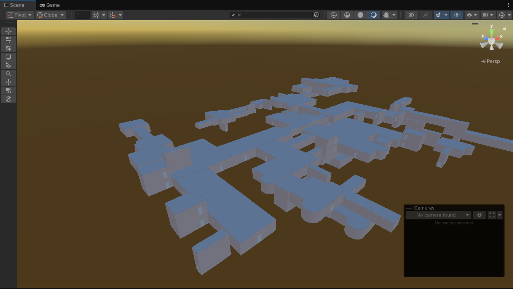

# **Unity-Procedural-Level-Generator**
A room-based, breadth-first-search-designed level generator made to create branched, maze-like room structures.

## Overview
This level generator is designed for games that need a randomized, maze-like structure such as horror games or roguelikes.
It also supports infinite generation: each level includes a room with a button that leads to the next level, restarting the generation cycle.

## Explanation of the code
1. The scene loads, triggering StartGeneration(). (This is the core loop of the program.)
2. StartGeneration() instantiates the entrance room and initializes the roomQueue, which is used for BFS.
3. The algorithm then loops through all the available entry points of the current parent room until none remain.
4. Within this loop, it selects a random candidate room or hallway, aligns it to the parent entry point, and runs a collision check.
5. If there’s an overlap, the new room is removed and the loop repeats. If not, the room is added to the queue.
6. Once a room has all its available entry points filled, the next room in the queue becomes the new parent.
7. This process continues inside the while loop until the maximum room count is reached or the maximum number of attempts is exhausted.

## Further improvements
I want to rework this algorithm to use some form of 3D array. This would allow for more advanced algorithms like A*, making gameplay more engaging with rooms connecting into each other and forming loops that players can get lost in.

